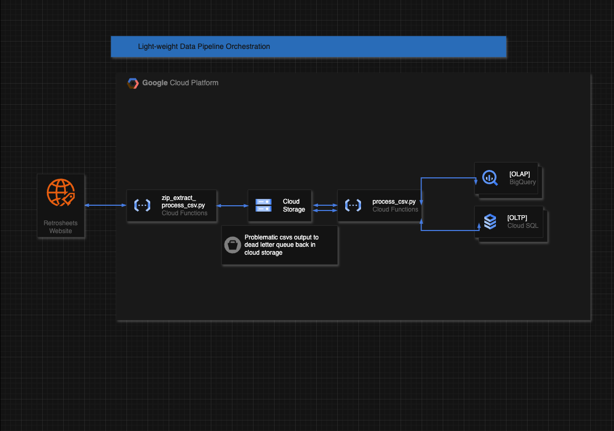
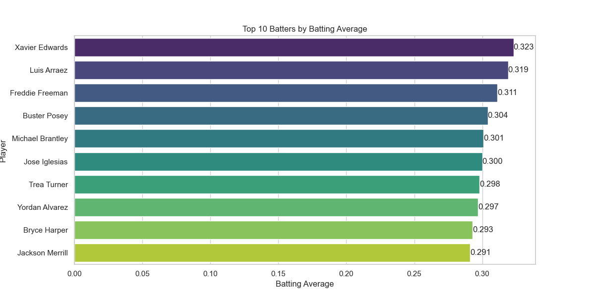
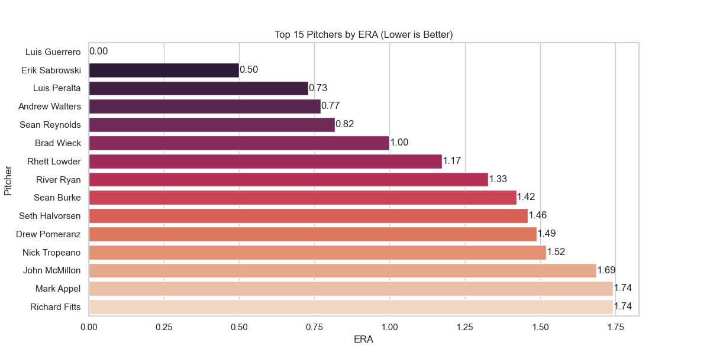

# Initial Data exploration 

- Retrosheets has a part of the website whcih extracts from raw data fields so we will cut work and download the csvs.

## Part 1. Data Preparation
- *Use Python and SQL to ingest and transform data from Retrosheet (https://www.retrosheet.org/game.htm).* 

### Scripts: 
1. Extracts.py - Extracts yearly zipped data files from the retrosheets site above
2. Load.py - Load data extracted from CSV files into pandas dataframe to load into sqlite3 db
3. Transform.py - Combine all the separately added tables 
4. InitializeDW.py - Create fact and dimension tables 

- *Identify fields relevant to team performance, game outcomes, etc.*

csv data description: (https://www.retrosheet.org/downloads/csvcontents.html) 
| **Analysis Goal**                | **Critical Fields**                         |
|----------------------------------|---------------------------------------------|
| *Batting Consistency*            | `hits`, `strikeouts`, `batting_avg`         |
| *Power Hitting*                  | `home_runs`, `slugging_pct`                 |
| *Plate Discipline*               | `walks`, `strikeouts`                       |
| *Clutch Hitting*                 | `rbi`, `hits`                               |
| *Base Running Efficiency*        | `stolen_bases`, `caught_stealing`           |
| *Pitcher Control*                | `walks_allowed`, `strikeouts`               |
| *Defensive Reliability*          | `errors`, `double_plays`                    |
| *Home/Away Splits*               | `home_win`, `visiting_win`, `attendance`    |

## Part 2. Schema Design

- *Define a relational schema that captures core entities such as games, teams, and
players.*

### Dimension Tables (Descriptive Context)
#### DimPlayer
- Created from: allplayers table
- Fields:
  - player_id (PK) - Unique player identifier
  - player_name - Combined first and last name
  - first_name - Player's first name
  - last_name - Player's last name
  - batting_hand - Batting side (L/R/B)
  - throwing_hand - Throwing side (L/R/?)

#### DimTeam
- Created from: Union of team fields across all tables

- Fields:
  - team_id (PK) - Short team code (e.g., "NYA" for Yankees)
  - team_code - Alias for team_id (for consistency)

#### DimGame
- Created from: gameinfo table

- Fields:
  - game_id (PK) - Unique game identifier
  - game_date - Date of the game (linked to DimDate)
  - season - Year of the season
  - ballpark - Stadium/venue name
  - visiting_team_id (FK to DimTeam)
  - home_team_id (FK to DimTeam)
  - visitor_runs - Runs scored by the away team
  - home_runs - Runs scored by the home team
  - Weather/field conditions: temperature, wind_speed, precipitation, sky_conditions
  - Game logistics: attendance, game_duration_minutes, forfeit, suspended

#### DimDate
- Generated programmatically from the date range in gameinfo

- Fields:
  - date_id (PK) - Date in YYYY-MM-DD format
  - year - Calendar year
  - month - Numeric month (1-12)
  - day - Day of the month
  - day_of_week - Weekday (0=Monday, 6=Sunday)
  - season_period - "Regular" (Mar-Oct) or "Offseason"

### Fact Tables (Measurable Events)
#### FactBatting
- Created from: batting + gameinfo tables
- Fields:
  - game_id (FK to DimGame)
  - player_id (FK to DimPlayer)
  - team_id (FK to DimTeam)
  - game_date (FK to DimDate)
- Metrics:
  - Plate appearances (b_pa), at-bats (b_ab)
  - Hits (b_h), home runs (b_hr), RBI (b_rbi)
  - Walks (b_w), strikeouts (b_k), stolen bases (b_sb)
- Flags:
  - is_dh (1 if designated hitter)
  - is_pinch_hitter, is_pinch_runner

#### FactPitching
- Created from: pitching + gameinfo tables
- Fields:
  - game_id (FK to DimGame)
  - player_id (FK to DimPlayer)
  - team_id (FK to DimTeam)
  - game_date (FK to DimDate)
- Metrics:
  - Outs recorded (p_ipouts), earned runs (p_er)
  - Strikeouts (p_k), walks allowed (p_w)
  - Hits allowed (p_h), balks (p_bk)
- Outcome Flags:
  - is_winning_pitcher, is_losing_pitcher, is_save

#### FactGameOutcomes
- Created from: gameinfo + teamstats tables
- Fields:
  - game_id (FK to DimGame)
  - visiting_team_id (FK to DimTeam)
  - home_team_id (FK to DimTeam)
- Results:
  - visiting_win (1 if away team won)
  - home_win (1 if home team won)
  - tie (1 if tied)
- Stats:
  - visiting_runs, home_runs
  - game_duration_minutes, attendance

#### FactPlays (Optional/Advanced)
- Created from: plays table
- Fields:
  - game_id (FK to DimGame)
  - batter_id (FK to DimPlayer)
  - pitcher_id (FK to DimPlayer)
- Play Details:
  - inning, pitch_count, pitch_sequence
  - Outcome flags (is_single, is_home_run, is_strikeout)
  - Base runners before/after play

### Explanation
- The **star schema** was utilized here to define a relational database with fact and dimension tables
  - This mainly enhances query performance and manufacturing as simple joins are needed 
  - Denormalized dimensions of the data tables prevent data redundancy and can save costs over time as data intake increases
  - Great for OLAP (Online Analytical Processing) since creating aggregations over time periods become easier
  - Implement indexing for better query performance as well

## Part 3. Data Pipeline & Operationalization
- *Outline how you would automate and maintain the extraction and transformation
process.*
- *Consider factors such as scalability, scheduling, data quality, and extensibility.*
- *Suggest how the data could be surfaced to non-technical stakeholders (e.g.,
executives, analysts).*  

### Solution Diagram
  

### Explanation 
> #### Assumptions
> In order to architect an effective solution, we have to take considerations  of where the stakeholder for this solution is currently position as well as his current use cases with anticipated ones. 
> 
> This is where you want to find determining questions in their organization like:
> 1. How big is your downstream development team (i.e reporting/model development)? And what is their overall skill level
> 2. Do you plan on utilizing this data for application usage? What other use cases (i.e model development, dashboarding)
> 3. How much are you budgeting on building out your data platform and how do you anticipate it will increase in the future?
> 
> For our purpose and based on this case, it looks like the stakeholder is now beginning to initialize the adoption of a dataplatform to make more data driven decisions.
> Since many of the questions pertain to KPIs for tracking overall team efficency and performance we can deduce that they need more of an OLAP workflow for analytical reporting use cases. 
> As such we want to develop a solution that is relatively lightweight and does not tie the organization too heavily to a cloud vendor or other managed services since they are still in the early stages of their data unification stragey. At the sametime it is able to be easily migrated if the stakeholder is looking to add additional data streams and grow out their overall data practice and/or add on potential use cases (i,e application usage of data)
> 
> #### Outline
> For our solution, we will be utilizing light weight Google Cloud Platform managed services. We will be following a similar process to our extract method outlined in part 1. However, we will have a function that extracts the zip files and and extracts those csv files into google cloud storage partitioned by year. This will be a function that has scheduled processesing and we can initiate an initial bulk load and then update this cloud function to unzip and load csv files in an appending fashion. The scheduling is performed by google cloud schedeler that carries out the actions in the defined cloud function. We schedule on a specified time because there is no way to determine when data is going to be published and want to reduce the amount cloud usage by "event-listening" for the time being. After the data is landed into GCS, we will have another cloud function that will get triggered automatically (due to internal gcp hook) when new files are updated in google cloud storage. The files are then taken and uploaded into a single master table like we did in part one where we combined the tables, except the new appended csv will just overwrite/append to the year partition. From here we want to finally implement our star schema for tables to make OLAP reporting workflows more effective. We will have DDLs for the initial bulk load and then DDLs for incremental loads after that. These tables in big query can easily be explored as it is a datawarehouse technology for overall querying and ML.
>
> #### Considerations
> Although the sizes of the zips and csvs stay relatively consistent throughout and should not cause issues when the pipeline is switched to append mode, we still want to account for some increase potential dataflow so we want to ensure some degree of scalability. Since the next generation of cloud functions comes with automatic auto scaling for effective usage of resources this is abstracted from us. This is a good thing as it will also require less man-power and investment to manage this data workflow. For data quality, we can create a dead letter queue for csv's that are not able to be successfully converted into part of the big query table. Another consideration as this data gets scaled up is to add another reconcilation workflow that can count the rows from a csv files and rows from the joined data table to ensure that data is being landed correctly in big query. Finally to make this workflow extensible the lightweight decoupled architecture will allow us to also write CSV data to an accompanying Cloud SQL instance if we want to use this data load pipeline for OLTP workflows as well like application development. 
> 
> #### Exposing Data
> As stated previously, with the data being parked in Big Query as a datawarehouse we can additional packages in BigQuery ML to build ML models with out data. On top of this, Looker is a reporting visualization tool that is free for use in the GCP platform so aside from making derived data tables to capture metrics in BigQuery we can also make accompnying visualizations for non-technical stake holders to gain data driven insights from. 

## Part 4. Demonstrating Usability
- *Provide one or more examples of how the structured dataset could be used to
answer high-level questions related to performance or strategy.*

- *These examples are meant to illustrate the value of the model rather than serve as
a deep analysis. Feel free to use a visualization tool of your choice.*

  
  

Here are two graphs created from the data above that would be helpful in future dashboarding. Having figures like this will help maintain player performance by tracking overall important metrics and displaying for all types of users (technical and non-technical) to understand. 

